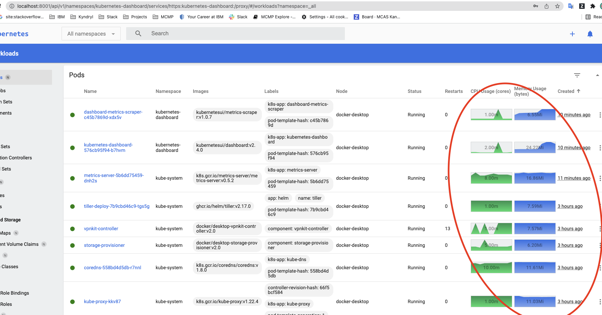

# Configure Kubernetes Dashboard

Dashboard is a web-based Kubernetes user interface. You can use Dashboard to deploy containerized applications to a Kubernetes cluster, troubleshoot your containerized application, and manage the cluster resources.



## Pre-requirements

- Install Docker Desktop

### Install Kubernetes Dashboard

#### Step 1: Clone repo with config files
``` bash linenums="1"
# If you already cloned the repo, remember to always check changes for repo "carlos/mcmp-config-files" by doing "git pull"
git clone https://github.com/JuankCR16/Kubernetes_Dasboard.git
```

#### Step 2: Create metric server resources

Create metric server resources to enable “top” example: `kubectl top pod -A`

``` bash linenums="1"
# Update resources for metrics server components
kubectl apply -f ./metrics-server-components.yaml

# serviceaccount/metrics-server created
# clusterrole.rbac.authorization.k8s.io/system:aggregated-metrics-reader # created
# clusterrole.rbac.authorization.k8s.io/system:metrics-server created
# rolebinding.rbac.authorization.k8s.io/metrics-server-auth-reader created
# clusterrolebinding.rbac.authorization.k8s.io/# metrics-server:system:auth-delegator created
# clusterrolebinding.rbac.authorization.k8s.io/system:metrics-server created
# service/metrics-server created
# deployment.apps/metrics-server created
# apiservice.apiregistration.k8s.io/v1beta1.metrics.k8s.io created
```

#### Step 3: Create kubernetes dashboard resources

* Check last version of Kubernetes dashboard: https://github.com/kubernetes/dashboard/releases

``` bash linenums="1"
kubectl apply -f https://raw.githubusercontent.com/kubernetes/dashboard/v2.7.0/aio/deploy/recommended.yaml

# namespace/kubernetes-dashboard created
# serviceaccount/kubernetes-dashboard created
# service/kubernetes-dashboard created
# secret/kubernetes-dashboard-certs created
# secret/kubernetes-dashboard-csrf created
# secret/kubernetes-dashboard-key-holder created
# configmap/kubernetes-dashboard-settings created
# role.rbac.authorization.k8s.io/kubernetes-dashboard created
# clusterrole.rbac.authorization.k8s.io/kubernetes-dashboard created
# rolebinding.rbac.authorization.k8s.io/kubernetes-dashboard created
# clusterrolebinding.rbac.authorization.k8s.io/kubernetes-dashboard created
# deployment.apps/kubernetes-dashboard created
# service/dashboard-metrics-scraper created
# deployment.apps/dashboard-metrics-scraper created
```

#### Step 4: Review all resources created in namespace

``` bash linenums="1"
kubectl get all -n kubernetes-dashboard

# NAME                                             READY   STATUS    RESTARTS   AGE
# pod/dashboard-metrics-scraper-79c5968bdc-kxlnd   1/1     Running   0          40s
# pod/kubernetes-dashboard-7448ffc97b-8b7h2        1/1     Running   0          40s

# NAME                                TYPE        CLUSTER-IP       EXTERNAL-IP   PORT(S)    AGE
# service/dashboard-metrics-scraper   ClusterIP   10.106.119.105   <none>        8000/TCP   40s
# service/kubernetes-dashboard        ClusterIP   10.100.104.250   <none>        443/TCP    41s

# NAME                                        READY   UP-TO-DATE   AVAILABLE   AGE
# deployment.apps/dashboard-metrics-scraper   1/1     1            1           40s
# deployment.apps/kubernetes-dashboard        1/1     1            1           41s

# NAME                                                   DESIRED   CURRENT   READY   AGE
# replicaset.apps/dashboard-metrics-scraper-79c5968bdc   1         1         1       40s
# replicaset.apps/kubernetes-dashboard-7448ffc97b        1         1         1       41s
```

#### Step 5: Configure admin user:

``` bash linenums="1"
# Update resources for admin user
kubectl apply -f ./admin-user.yaml
# serviceaccount/admin-user created
```

#### Step 6: Get admin user token:

``` bash linenums="1"
kubectl -n kubernetes-dashboard describe secret $(kubectl -n kubernetes-dashboard get secret |grep admin-user-token | awk '{print $1}')

# Name:         admin-user-token-f6nbv
# Namespace:    kubernetes-dashboard
# Labels:       <none>
# Annotations:  kubernetes.io/service-account.name: admin-user
#               kubernetes.io/service-account.uid: 0095b038-d2d7-45ec-9926-2b510869e629

# Type:  kubernetes.io/service-account-token

# Data
# ====
# token:      eyJhbGciOiJSUzI1NiIsImtpZCI6IlZETi1wd0h0TGpveXpvVUtWYXI2MFlwQlgwR1lQcTk0MnVHeUhGaHo1SlkifQ.eyJpc3MiOiJrdWJlcm5ldGVzL3NlcnZpY2VhY2NvdW50Iiwia3ViZXJuZXRlcy5pby9zZXJ2aWNlYWNjb3VudC9uYW1lc3BhY2UiOiJrdWJlcm5ldGVzLWRhc2hib2FyZCIsImt1YmVybmV0ZXMuaW8vc2VydmljZWFjY291bnQvc2VjcmV0Lm5hbWUiOiJhZG1pbi11c2VyLXRva2VuLWY2bmJ2Iiwia3ViZXJuZXRlcy5pby9zZXJ2aWNlYWNjb3VudC9zZXJ2aWNlLWFjY291bnQubmFtZSI6ImFkbWluLXVzZXIiLCJrdWJlcm5ldGVzLmlvL3NlcnZpY2VhY2NvdW50L3NlcnZpY2UtYWNjb3VudC51aWQiOiIwMDk1YjAzOC1kMmQ3LTQ1ZWMtOTkyNi0yYjUxMDg2OWU2MjkiLCJzdWIiOiJzeXN0ZW06c2VydmljZWFjY291bnQ6a3ViZXJuZXRlcy1kYXNoYm9hcmQ6YWRtaW4tdXNlciJ9.OsUbi_3ZRbCE3AB8189kjpEMVkF4fHjYYfRiWLALvNOvOpetAahkXNRVgfb9o3xZvKEGjLrmSuytFugXf6IyBVRRnBFc-uVpmpfFgEcwQ7iJRpHuUZ5yJNaNJrajxrzek59sjLtFAMpayRNt7_-zxwBdGqrCi3OuOS_MHsAMkEBNGe0sTb0ynLq7SqqK-N6tinT1T9mRN6FZ7CF0lluFh9r_ffzNx1HwlkMQm8ehNIx-OPYn6p2dfxmROn7WPb4ulLTz4cWmScav0iQlBUYAykHenXEyRWophZDyAnlK_hEF9ab5WYErJ9qQUdJvknO5prLdAH775mJuNtBg0HvJGg
# ca.crt:     1099 bytes
# namespace:  20 bytes
```

#### Step 7: Run kubernetes proxy

``` bash linenums="1"
kubectl proxy

#Starting to serve on 127.0.0.1:8001
```

#### Step 8: Go to kubernetes login page link:

* http://localhost:8001/api/v1/namespaces/kubernetes-dashboard/services/https:kubernetes-dashboard:/proxy/#/login

#### Uninstall (Optional)
1. Remove metrics server resources:
    ``` bash linenums="1"
    # Delete resources for metrics server components
    # This yaml is created from https://github.com/kubernetes-sigs/metrics-server/releases/latest/download/components.yaml
    kubectl delete -f ./metrics-server-components.yaml
    ```

2. Remove kubernetes dashboard resources:
    ``` bash linenums="1"
    kubectl delete -f https://raw.githubusercontent.com/kubernetes/dashboard/v2.7.0/aio/deploy/recommended.yaml
    ```
